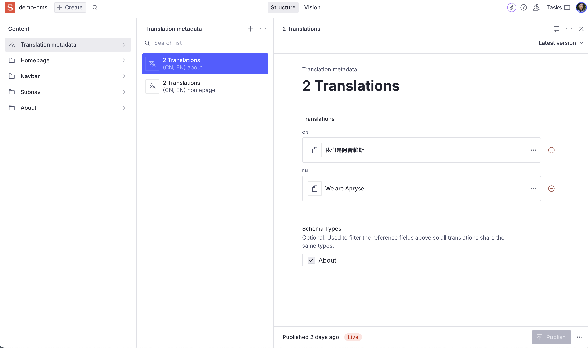
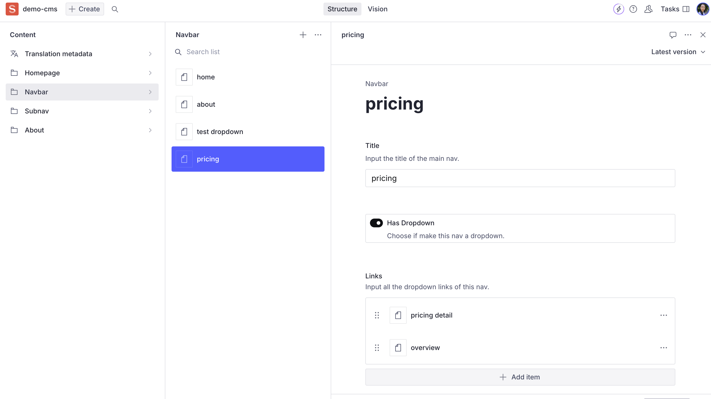

# Sanity CMS

This project implemented Sanity v3 CMS Localization demo. 

## Screenshots

## How to start
1. run `sanity init` to login and setup.
2. use Node 18+ and run `npm run dev` to open the sanity studio.